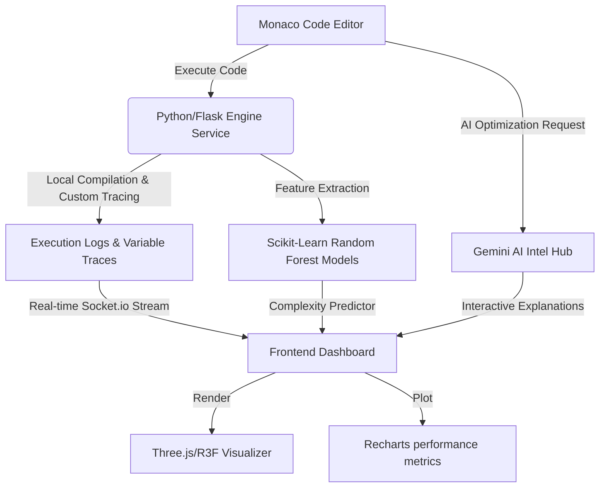

# KODA: The AI-First Code Editor & Performance Diagnostics IDE 🚀

**KODA** is a next-generation, developer-centric Web IDE designed for writing, execution-tracing, and optimizing high-performance code. Moving beyond traditional, static code editors and passive algorithm visualizers, Koda acts as an active development companion. It integrates a custom-engineered C++ execution engine with a machine learning model and Google Gemini-powered intelligence to deliver real-time variable tracing, deep logic inspection, and line-by-line complexity diagnostics.

Whether you are writing competitive programming solutions, optimizing hot paths, or learning advanced structures, KODA gives you microscopic visibility into how your code behaves and performs.

---

## 💡 Project Motive & Vision

Traditional code editors tell you *what* syntax is wrong, while algorithm visualizers show you pre-rendered, rigid animations of classic routines. **KODA bridges this gap.** 

We believe writing code should be an interactive, informative dialogue between the editor and the developer. KODA's motive is to provide:
- **Intimate Execution Visibility**: Track how variables mutate, pointers traverse, and branches execute in real time.
- **Explainable Performance**: Don't just learn that your code is $O(N^2)$; understand exactly which loop nest or recursive branch is causing the bottleneck.
- **Fluid Developer Experience**: A clean, single-window workspace featuring Monaco Editor, integrated terminal logs, real-time metrics, and 3D/2D visualization panels optimized for both desktop and mobile developers.

---

## ✨ Core Features



### 1. The Developer's Workspace
*   **Monaco Editor Integration**: The same engine powering VS Code, complete with syntax highlighting, automatic indentation, code folding, and multi-cursor support.
*   **Integrated Terminal**: Real-time terminal output displaying build, run, and standard input/output streams.
*   **Responsive Multi-Panel Layout**: An optimized grid system that keeps the editor, terminal, visualizer, and AI assistant at your fingertips without clutter.

### 2. Real-Time Logic Tracing & Variable Inspection
*   **Dynamic Variable Tracing**: Watch your C++ variables, vectors, and pointers change state step-by-step.
*   **3D & 2D Visualization Canvas**: Powered by Three.js and Framer Motion, watch complex data structures and execution flow frames animate dynamically.
*   **Control Flow Diagnostics**: Visually trace the active execution path, highlighting loop bounds, branching paths, and deep recursion frames.

### 3. Predictive Machine Learning Engine
*   **AST Feature Extraction**: Analyzes loop nesting depths, branching factors, and data structures from your source code.
*   **ML-Powered Complexity Predictions**: Uses custom Scikit-Learn Random Forest models trained on thousands of samples to instantly predict time and space complexity class bounds.

### 4. Gemini AI Complexity Teacher
*   **Line-by-Line Diagnostics**: Breaks down structural elements in your code, highlighting performance bottlenecks and suggesting modern optimizations.
*   **Case Analysis**: Automatically calculates and explains the Differences between Best, Average, and Worst-case execution paths.
*   **Interactive Code Mentor**: Ask specific questions about your code directly within the built-in AI panel to get instant, context-aware architectural feedback.

---

## 🛠️ Technology Stack

Koda is architected as a set of decoupled microservices designed to keep client-side rendering fast and execution environments secure.

| Layer | Technology | Key Use Cases |
| :--- | :--- | :--- |
| **Frontend UI** | React 19, Vite | Fast SPA scaffolding, component lifecycle management. |
| **Styling & Animation** | Tailwind CSS v4, Framer Motion | Glassmorphic design, fluid sliding panels, micro-animations. |
| **Core Editor** | `@monaco-editor/react` | Code writing canvas with bracket-matching and theme support. |
| **3D & 2D Graphics** | Three.js, React Three Fiber, Drei | Dynamic memory state rendering and variable relationship visualization. |
| **Data Plotting** | Recharts | Theoretical performance curves and stress-test data graphs. |
| **Real-time Comms** | Socket.io Client | Bidirectional event streaming for real-time execution outputs. |
| **AI Integration** | `@google/genai` | Native Google Gemini SDK integrations for complexity analyses. |
| **Auth Backend** | Express, Node.js, Mongoose, MongoDB | User registration, JWT sessions, security, and document persistence. |
| **Execution Engine**| Flask, Flask-SocketIO, Eventlet | High-concurrency sandbox running C++ compilation and runtime tracing. |
| **Machine Learning**| Scikit-Learn, Joblib, NumPy | Random Forest complexity and memory consumption estimators. |

---

## 🚀 Getting Started & Local Setup

### Prerequisites
To run Koda locally, you will need:
- **Node.js** (v18 or higher)
- **Python** (v3.9 or higher)
- **C++ Compiler** (GCC/G++ with GDB capabilities)
- **MongoDB** (Local instance or Atlas connection string)
- **Google Gemini API Key** (for AI Hub integrations)

### Installation & Initialization

1. **Clone the Repository**:
   ```bash
   git clone https://github.com/Kshitiz-kothari31/Koda.git
   cd Koda
   ```

2. **Run Frontend (Client)**:
   ```bash
   cd client
   npm install
   npm run dev
   ```

3. **Run Authentication Service**:
   ```bash
   cd ../services/auth-service
   # Create a .env file with PORT, MONGO_URI, and JWT_SECRET
   npm install
   npm run start
   ```

4. **Run Complexity & Execution Engine**:
   ```bash
   cd ../services/engine-service
   # Setup virtual env (optional but recommended)
   python -m venv venv
   source venv/bin/activate # or venv\Scripts\activate on Windows
   pip install -r requirements.txt
   python app.py
   ```

---

## 🧠 Architecture & Under-the-Hood

### Real-Time Tracing Mechanics
When you click **Run** in the editor, your code is securely sent to the Flask-based Engine Service. The compiler builds a binary instrumented with debug hooks. Execution is stepped using a tracer wrapper that captures variable mutations, pointer addresses, and call stacks. The state change events are serialized and pushed back to the client via WebSockets to keep the frontend UI reactive and lag-free.

### ML-Driven Complexity Predictor
The static analyzer parses the C++ code into an Abstract Syntax Tree (AST), counting nested structures and computing features. These feature vectors are run against trained Random Forest regressors/classifiers (`complexity_model.pkl` and `space_model.pkl`) to instantly output predicted algorithmic complexities alongside standard theoretical limits.

---

## 📄 License
This project is licensed under the MIT License. See the [LICENSE](file:///d:/VS Code/College Projects/KODA/LICENSE) file for details.

---

**Built with ❤️ by and for Software Developers.**
